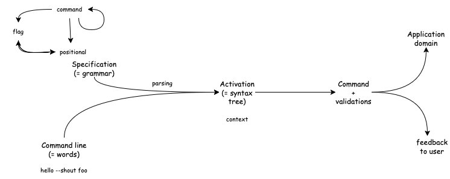
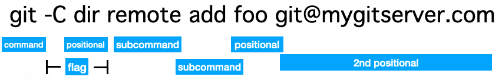
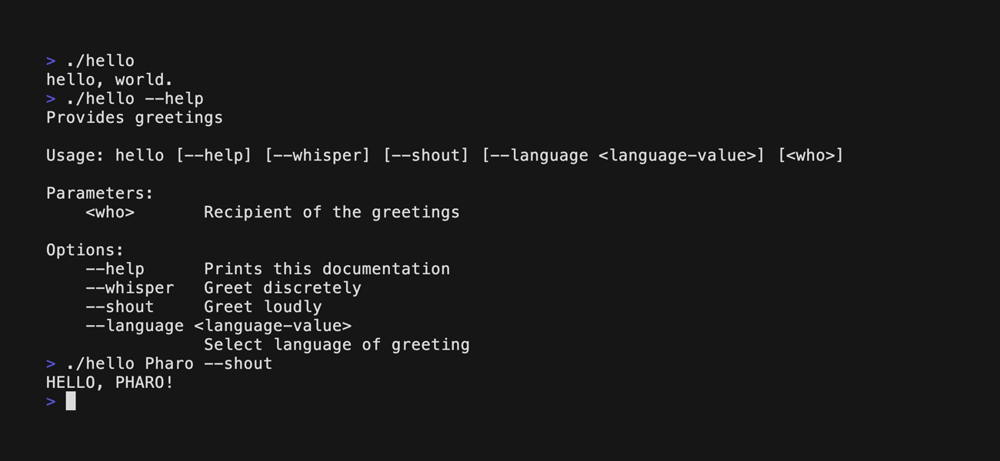

# CLAP — Command line argument parser for Pharo

Clap is a library for implementing command line applications.
Named after and inspired by [clap-rs](https://github.com/kbknapp/clap-rs), but this is an independent implementation.


Clap is a framework for adding rich command line interfaces to Pharo code; it sits at the frontier of the image, between application code and the shell environment. There are two main families of objects in Clap:

- Specifications describe the syntax and behavior of commands that the image understands.
- Activations represent command invocations and their arguments, their domain-level meaning, and which words they map to.

Here is the general workflow with Clap:
1. On the shell side, the user invokes a command, either directly in the terminal or from a shell script; for convenience, that command would usually be an alias or a small wrapper around the correct Pharo virtual machine and image.
1. On the image side, Clap receives the command with its arguments as an array of words, and creates an activation context, matching the arguments with known commands specifications.
1. A successful match will give you back an instance of the command. This command define the (business) application code and can query the context to retrieve command parameters, access external resources like input/output streams.
1. When the application code runs to completion, Clap cleanly exits the image. Alternatively, the application can tell the context to terminate early, with a deliberate exit status, or if it fails to handle an exception, Clap catches it and gracefully reports the error.



## Anatomy of a command
To strike a balance between following established conventions and keeping a simple and coherent model, Clap provides three kinds of parameters, each with specific nesting, matching, and semantic properties:



- _Positionals_ are recognized in order, relative to their sibling positionals, and do not have child parameters of their own; they convey meaning through the form of the word they match, once parsed into some adequate domain value, like a number or an URL.


- _Flags_ are parameters identified by keywords which usually start with dashes to distinguish them from other parameters; they are also know as _options_ in the jargon. They convey meaning through their presence, absence, number of occurrences, and order in the command line. A flag can have child positionals, resulting in a named parameter.


- _Commands_ are identified by keywords. They can have positionals and flags as children parameters, but also other commands. Sibling commands are exclusive, and a subcommand takes precedence over its parent command, which helps with structuring applications into multiple subcommands.


## Defining commands

Commands (and subcommands) specifications are instances of `#ClapCommandSpec`. To make a command accessible from the command line, return it from a class-side factory method with the <commandline> pragma. Such class-side method should be defined on user-defined subclass of ClapApplication. For instance, here's how we declare the traditional hello, world! example, with the actual behavior delegated to the instance-side method `ClapCommandLineExamples >> sayHello:`

```language=smalltalk
hello
	"The usual Hello-World example, demonstrating a Clap command with a couple features."
	<commandline>
	^ (ClapCommandSpec id: #hello)
		description: 'Provides greetings';
		commandClass: self;
		addHelp;
		addFlag: #whisper description: 'Greet discretely';
		addFlag: #shout description: 'Greet loudly';
		addFlag: #language 
			description: 'Select language of greeting' 
			positionalSpec: [ :positional |
				positional
					symbol;
					defaultValue: [ :arg :app | app defaultLanguage ] ];
		addPositional: #who spec: [ :positional |
			positional
				description: 'Recipient of the greetings';
				multiple: true;
				defaultValue: [ :arg :app | { app defaultRecipient } ] ];
		yourself
```

## A typical Clap command class
A typical Clap command class inherits from `ClapApplication`.
```language=smalltalk
ClapApplication << #MyCommand
  slots: {};
  package: 'MyCommand'
```
### Defining the command specification
We define a class-side method returning the command specification.  You can simply call it `commandSpecification`. If you are defining a root command, annotate the method with the pragma `commandline`.
```language=smalltalk
commandSpecification
    <commandline>
	^ (ClapCommandSpec id: #hello)
		description: 'Provides greetings';
		commandClass: self;
		addHelp;
        yourself
```
You must define the command class to instantiate in the command specification. This class is the class that inherits from `ClapApplication` and will contain the logic of your command. In most cases, it will be the class where you defined the command specification and by so, you will use self: `commandClass: self`. An instance of this command class will be returned when sending `#command`to a ClapContext.

### Defining accessors for flags, positionals
```language=smalltalk
recipients
    ^ self positional: #who
```

```language=smalltalk
isShouting
    ^ self hasFlag: #shout
```

This way, the logic of your command will be easier to read / write.

### Implement the command logic
When the command will be activated (i.e. parsing is done, command matched and validation is ok), the `execute` method will be executed. You implement the command logic there.
```language=smalltalk
execute
    self sayHello
```

## Running my command line app

Clap is already included into the core Pharo image. Since Pharo 14, Clap is the default command line handler: there is a `ClapCommandLineHandler` that is run at image startup to check if there are command line arguments to process.
Clap root commands are discovered through the `<commandline>` pragma. It means that if you implement your own command and the class is loaded in the image, you can already activate your command line with the proper command keyword (ex: hello). Your command will be available in addition to other Pharo commands (eval, version, st, metacello, test, etc.). 
Then you can activate your command by running in you favorite shell:
```language=bash
./Pharo.app/Contents/MacOS/Pharo --headless Pharo.image --no-default-preferences hello --shout
```




### Creating your own shell command
If you want to distribute your command as command line, your users may not be aware of Pharo and it is best to create a small shell script to wrap and hide the call to Pharo.
Here is an example of an hello command script named `hello`:
```language=bash
#!/usr/bin/env bash

# some magic to find out the real location of this script dealing with symlinks
DIR=`readlink "$0"` || DIR="$0";
DIR=`dirname "$DIR"`;

"$DIR"/MyApp.app/Contents/MacOs/Pharo --headless "$DIR"/MyApp.app/Resources/MyApp.image --no-default-preferences hello "$@"
```
In this example, you can see that all arguments passed to the script will be transmitted as arguments of the hello command implemented as a Clap command into the MyApp.image.

### Customizing commands
If you want to redefine the commands that you want to make available, you can customize the method `ClapContext>>#executeWithPragmaCommandsAndArguments:` to instantiate a context with only the commands you need. Here is an example:
```language=smalltalk
executeWithPragmaCommandsAndArguments: arguments

	(self withAll: { MyCommand commandSpecification })
			beObeyingExits;
			setStdio: Stdio;
			arguments: arguments;
			execute
```
It is also possible to define another command line handler for a specific usage. It can be done by subclassing `CommandLineHandler`, register it as default command line handler (`self registerAsCommandLinehandler`) and implement an `#activateCommand` method. It could be used to add a handler that protects commands by a password for example.

## Testing your command line app

With Clap, it is easy to test your command. The `ClapContext` of a command provides methods to get the activation (i.e. the command specification + the command arguments). It allows to test parsing, validation, execution as you wish.
Here is an example:
```language=smalltalk
testHelloFrench
    context := ClapCommandLineExamples hello activateWith: #('hello' '--language' 'fr').

    self assert: context exitStatus equals: 0.
    self
		assert: context stdio stdout contents utf8Decoded
		equals: 'bonjour, tout le monde.' , OSPlatform current lineEnding
```
Using `activateWith:` on the command specification gives you the activation (the Clap context) AND also execute the command.
That's why you can test the command exit code and outputs.

Here is another example: a test on the Pharo `eval` command:
```language=smalltalk
testCanGetStFile
	| command |
	context := ClapSTFileEvaluator commandSpecification activationWith: #('st' 'foo.st' 'bar.st' 'bla').
	command := context command.
	
	self
		assert: command allStFiles size
		equals: 2.
		
	self
		assertCollection: command allStFiles
		hasSameElements: #('foo.st' 'bar.st').
```
We test the logic of the `#allStFiles` method to ensure it only collects files with the relevant extension.
Note that we now use the `activationWith:` message tha gives you back the activation. Then, you need to run the matching, validation by yourself.
In this example, when calling `command`, these previous steps are called to ensure you get a usable instance of the command.

## Command line design

Here are some advide to design your command line:
- Split command-line logic from business logic to ease maintenance, reusability
- Offer a clear help
- Clear explanation when an error occurs
- Well thought API (like a web service).

### General structure
To structure your commands, you have 2 choices:
- Flat structure (ex: curl)
  - mycli init
  - mycli build
  - mycli deploy
- Hierarchical structure (ex: git, pharo-launcher)
  - mycli user add
  - mycli user delete
  - mycli config set

### Positionals Vs Flags
- Positionals: use them when mandatory and unambiguous
    `mycli rename old.txt new.txt`
- Flags (with positional): use them when optional and with a default value
    `mycli convert file.txt --format pdf`

### Output
The default output must be verbose and human readable!
Add a `--json` flag (or equivalent) to use the command in scripts.
Exit with the right return code:
- 0: success
- 1 or more : error