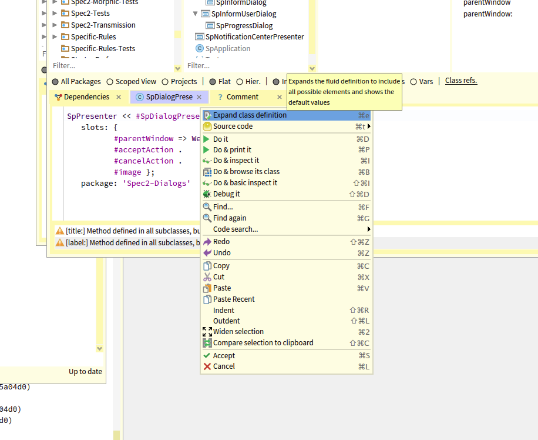
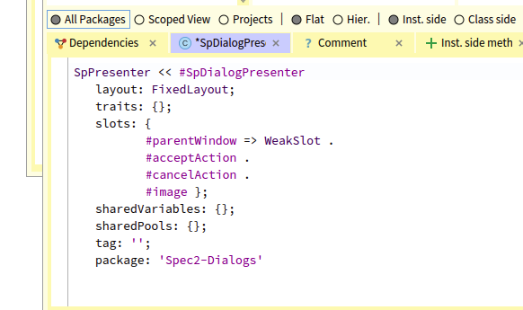

## About the fluid class syntax

Since several versions before Pharo 12, Pharo internally used a new representation for classes and a new syntax was optional.
Since Pharo 12 Pharo uses by default the fluid class syntax.
This syntax focuses on not forcing the developer to use long messages for empty information such as empty instance variables and empty class variables.
It also supports first class instance variables named Slot. 
And more importantly, it fixes the combinatorial explosion of the numbers of class creation methods in 
presence of traits, tag, and new class formats such as ephemerons and others. We did not do it for the fun but we think that we found a really nice syntax
that is based on messages, compact and supporting well optional information.
Now it does not mean instance variables are gone. Instance variables are default slots. 
Let us take a tour of the fluid syntax.

We start showing what is the minimum information required. Then we show that defining simple slots is as simple as defining instance variables. 
We then go systematic and illustrate all the situations. 


### The lovely empty class definition

With the fluid syntax, you only specify information that is needed. 
You do not need empty lists.

```
Object subclass: #AbstractTutorial
	instanceVariableNames: ''
	classVariableNames: ''
	package: 'ProfStef-Core'
```

is expressed as 

```
Object << #AbstractTutorial
	package: 'ProfStef-Core'
```

The messages `<<` and `package:` are the only mandatory ones. 
All the others are to be used when needed. 


### Instance variables and slots

Since several versions of Pharo, classes have first-class instance variables. It means that 
instance variables are represented as real objects but do not worry this has no runtime cost. 
When you do not need special instance variables such as weak or observable ones you can just use a symbol. 

The following definition of the class `Point`

```
Object subclass: #Point
	instanceVariableNames: 'x y'
	classVariableNames: ''
	package: 'Kernel-BasicObjects'
```

is now expressed as: 

```
Object << #Point
	slots: { #x . #y };
	tag: 'BasicObjects';
	package: 'Kernel'
```

`instanceVariableNames: 'x y'` is replaced by `slots: { #x . #y };`. `{#x . #y}` defines a list of simple instance variables (internally represented by an instance of the class representing the instance variable and not just a symbol.

Note that the tag: message: is only needed when your class is placed in the package tag.


### Getting help from the IDE

If you want to add more information to the class definition you have to know information that is not shown by default by the class definition. 
This can be a bit painful to guess. For this reason, the IDE helps you. Just place the caret on the class name and select the expand menu item. 
This will show all the possible messages that you can send to create a new class.





Now we are ready to go into the full details.

### The layout: message

Classes can have different internal formats: for example 


```
ArrayedCollection << #Array
	layout: VariableLayout;
	tag: 'Base';
	package: 'Collections-Sequenceable’
```

is the same as 

```
ArrayedCollection variableSubclass: #Array
	instanceVariableNames: ''
	classVariableNames: ''
	package: 'Collections-Sequenceable-Base'
```

If you want to know more, just look for the subclasses of `AbstractLayout`. 
By default, a class has a `FixedLayout` and you do not have to specify a layout. 


### The message `traits:`

In Pharo, a class can be composed out of trait composition using the message ` traits:`.


### Non-default instance variables

A slot is an object representing an instance variable. 
By default the programmer should use a symbol 
so you go from `‘x y’` to `{#x . #y}`.


This syntax lets us write more complex class definitions such as

```
SpPresenter << #SpDialogPresenter
	slots: {
			 #parentWindow => WeakSlot .
			 #acceptAction .
			 #cancelAction .
			 #image };
	package: 'Spec2-Dialogs'
```


Here `#parentWindow => WeakSlot` creates a slot of the class `WeakSlot` (does not count for garbage collector).


The following class definition shows that we can have instance variables which emits annoucements each time they
are changed. This is the behavior of `ObservableSlot`.

```
SpPresenter << #SpAbstractWidgetPresenter
	slots: {
			 #borderWidth => ObservableSlot .
			 #borderColor => ObservableSlot .
			 #dragEnabled => ObservableSlot .
			 #dropEnabled => ObservableSlot .
			 #color => ObservableSlot .
			 #help => ObservableSlot .
			 #enabled => ObservableSlot .
			 #wantsDrop => ObservableSlot .
			 #acceptDrop => ObservableSlot .
			 #deferredActions };
	tag: 'Widgets';
	package: 'Spec2-Core'
```


### The message sharedVariables:

You may not remember but `classVariables` in Pharo are shared between the instance and class side hierarchies. 
Read Pharo by Example if you need a little refresh. 

In the fluid class syntax we decided to name them better and we called them `sharedVariables`. A shared variable is exactly the same 
as an old classVariable except that you there is no confusion possible with classVariables and metaclass instance variables. 
So a class and metaclass can have slots and in addition shared variables. 

Therefore 
 
```
WeakIdentityKeyDictionary << #ASTCache
	sharedVariables: { #CacheMissStrategy };
	tag: 'Parser';
	package: 'AST-Core'
```
is the same as 

```
WeakIdentityKeyDictionary subclass: #ASTCache
	instanceVariableNames: ''
	classVariableNames: 'CacheMissStrategy'
	package: 'AST-Core-Parser'
```

What you see is that we do not have to specify empty lists.

For example `TextConstants` defines the following shared variables.

```
SharedPool << #TextConstants
	slots: {};
	sharedVariables: { #Ctrls . #Ctrlh . #CtrlR . #CtrlG ..... };
	tag: 'Base';
	package: 'Text-Core'
```

It is exactly the same as the old message:

```
SharedPool subclass: #TextConstants
	instanceVariableNames: ''
	classVariableNames: 'Ctrls Ctrlh CtrlR CtrlG .....'
	package: 'Text-Core-Base'
```


### The message `sharedPools:`

It is rare to face the need for shared pools (also named poolDictionaries) but when you need to define a group of constants and use these constants in different class hierarchies then they are handy.

Now the old class definition of the class `Text` shown below:

```
ArrayedCollection subclass: #Text
	instanceVariableNames: 'string runs'
	classVariableNames: ''
	poolDictionaries: 'TextConstants'
	package: 'Text-Core-Base'
```

is now

```
ArrayedCollection << #Text
	slots: { #string . #runs };
	sharedPools: { TextConstants };
	tag: 'Base';
	package: 'Text-Core'
```

This is nearly one decade since pool dictionaries did not exist anymore. They are subclasses of `SharedPool`: a special class holding shared variables.

Now when you do not need them no need to be exposed to their definition.


### Conclusion

The fluid class is just better than the old one. It is compact, precise, and scales well in the presence of optional arguments.  

So far you see that if you need simple things, they are simpler to write. 
And the plus is that you can get more power for the same price. 
